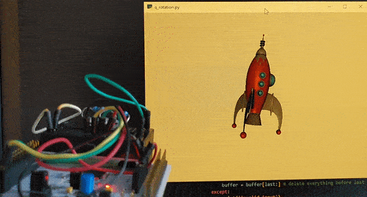

# 9axis_rotation_python_opengl

Rotation of a model in opengl using quaternions from a 9-axis sensor.

It receive quaternions via the serial port in json format:
```
{"quat_w":0.040, "quat_x":-0.374, "quat_y":-0.923, "quat_z":0.086}
```

# Installation

```
pip install https://download.lfd.uci.edu/pythonlibs/archived/PyOpenGL-3.1.6-cp39-cp39-win_amd64.whl
pip install numpy
pip install pywavefront
pip install pyglet
pip install pyserial
pip install squaternion
```

# Usage

- Download the model and update the path here: `path = '../models/10475_Rocket_Ship_v1_L3.obj'`
- Connect your sensor to your computer and put the name and number of the serial port in here: `ser = serial.Serial('<your serial port>',115200,timeout=0)`
- Run the program: ` python q_rotation.py`



# Links
- PyOpenGL whl file: https://www.lfd.uci.edu/~gohlke/pythonlibs/#pyopengl
https://download.lfd.uci.edu/pythonlibs/archived/PyOpenGL-3.1.6-cp39-cp39-win_amd64.whl
- model of rocket: https://free3d.com/3d-model/rocket-ship-v1--579030.html ("Personal Use License")
- project inspired by (and compatible with): https://github.com/ZaneL/quaternion_sensor_3d_nodejs
- sparkfun library for ICM-20948 sensor: https://github.com/sparkfun/SparkFun_ICM-20948_ArduinoLibrary
